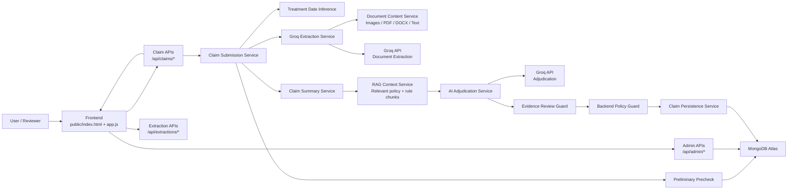
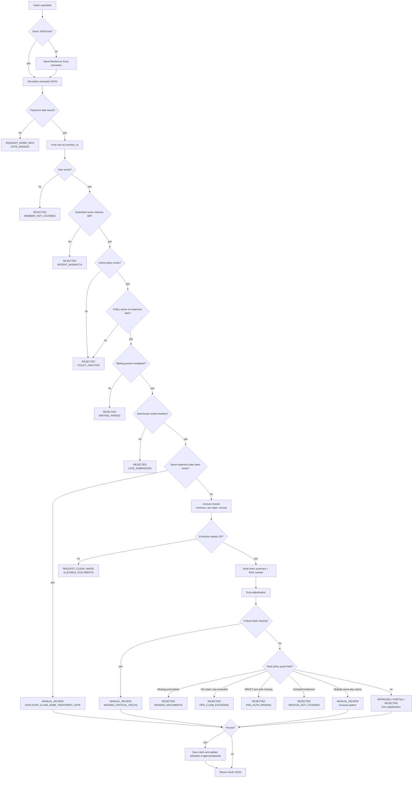

# Documentation

## Architecture Diagram



## Component Overview

### Frontend

Located in `public/`.

The frontend has two tabs:

- Claim tester: uploads documents, runs adjudication, shows readable decision details, and allows JSON download/copy.
- Add data: adds users, dependents, policies, and user-policy links to MongoDB.

### Backend

Located in `src/`.

`src/app.js` defines the Express app. `src/server.js` starts it locally. `api/index.js` adapts the same app to Vercel serverless functions.

### Database

MongoDB collections are modeled with Mongoose:

- `UserData`: employee/dependent member records.
- `PolicyData`: policy terms and coverage.
- `UserPolicy`: active/inactive links between users and policies.
- `UserPolicyClaims`: submitted claim history, adjudication result, and utilization evidence.

### AI And RAG

The project uses a compact RAG approach:

1. Extract or receive document JSON.
2. Summarize the extraction into compact claim facts.
3. Detect claim topics such as `diagnostic`, `dental`, `limits`, `exclusions`, `duplicates`, and `authenticity`.
4. Retrieve only relevant policy fields and rule chunks.
5. Send the compact `claim_summary` and `rag_context` to Groq.
6. Apply backend evidence and policy guards after AI returns.

This reduces token usage compared with sending full policy files, full test cases, and full extracted documents.

## Decision Logic Flowchart



## API Documentation

Base URL locally:

```text
http://127.0.0.1:4000
```

Base URL on Vercel:

```text
https://your-project.vercel.app
```

### Health

#### `GET /api/health`

Checks whether the API is reachable.

Response:

```json
{
  "status": "ok"
}
```

### Claim APIs

#### `POST /api/claims/verify`

Verifies member and active policy without full adjudication.

JSON body:

```json
{
  "member_id": "EMP001",
  "member_name": "Rajesh Kumar",
  "treatment_date": "2024-11-01",
  "claim_amount": 1500,
  "submission_date": "2024-11-02"
}
```

#### `POST /api/claims/submit`

Runs the full file upload pipeline:

1. Document extraction through Groq.
2. Treatment date inference.
3. Preliminary eligibility checks.
4. RAG-backed AI adjudication.
5. Backend policy/evidence guards.
6. Persistence to DB.

Content type: `multipart/form-data`

Fields:

```text
member_id
member_name
claim_amount
submission_date optional
previous_medical_conditions optional
adjudication_mode normal|strict
update_db_on_manual_review true|false optional
instructions optional
documents one or more files
```

Supported files:

- Images
- PDFs
- DOCX
- Text/JSON files

#### `POST /api/claims/test-json`

Runs adjudication from already-extracted JSON. This is useful for testing without paying extraction tokens.

JSON body:

```json
{
  "member_id": "EMP001",
  "member_name": "Rajesh Kumar",
  "claim_amount": 1500,
  "submission_date": "2024-11-02",
  "adjudication_mode": "normal",
  "update_db": false,
  "extraction": {
    "claim_extraction": {
      "summary": {
        "overall_treatment_date_range": {
          "start_date": "2024-11-01",
          "end_date": "2024-11-01"
        }
      },
      "documents": {
        "prescriptions": [],
        "medical_bills": [],
        "diagnostic_reports": [],
        "pharmacy_bills": []
      }
    }
  }
}
```

#### `POST /api/claims/save-manual-review`

Persists a manual review result after a reviewer accepts it in the UI.

Body: the full previous claim result JSON returned by `/api/claims/submit` or `/api/claims/test-json`.

### Extraction APIs

#### `POST /api/extractions/groq`

Extracts OPD document information from uploaded files without adjudication.

Content type: `multipart/form-data`

Fields:

```text
documents one or more files
instructions optional
```

#### `POST /api/extractions/grok`

Alias for `/api/extractions/groq`.

### Admin APIs

#### `GET /api/admin/users`

Returns recent users for UI dropdowns.

#### `POST /api/admin/users`

Creates or updates an employee/dependent.

JSON body:

```json
{
  "member_id": "EMP011",
  "member_name": "Asha Rao",
  "member_type": "Employee",
  "company_name": "TechCorp Solutions Pvt Ltd",
  "join_date": "2024-01-01",
  "date_of_birth": "1992-05-10",
  "gender": "Female",
  "pre_existing_conditions": "diabetes, hypertension"
}
```

Dependent example:

```json
{
  "member_id": "DEP011",
  "member_name": "Arjun Rao",
  "member_type": "Dependent",
  "primary_member_id": "EMP011",
  "company_name": "TechCorp Solutions Pvt Ltd",
  "join_date": "2024-01-01",
  "gender": "Male"
}
```

#### `GET /api/admin/policies`

Returns recent policies for UI dropdowns.

#### `POST /api/admin/policies`

Creates or updates a policy.

Minimal JSON body:

```json
{
  "policy_id": "PLUM_OPD_2024",
  "policy_name": "Plum OPD Advantage",
  "company_name": "TechCorp Solutions Pvt Ltd",
  "effective_date": "2024-01-01",
  "annual_limit": 50000,
  "per_claim_limit": 5000,
  "submission_timeline_days": 30,
  "initial_waiting_days": 30,
  "exclusions": "Cosmetic procedures, Weight loss treatments",
  "documents_required": "Original bills, Prescription from registered doctor"
}
```

#### `POST /api/admin/user-policies`

Links a user to a policy.

JSON body:

```json
{
  "member_id": "EMP011",
  "policy_id": "PLUM_OPD_2024",
  "enrollment_date": "2024-01-01",
  "status": "Active"
}
```

## Decision Outputs

Possible final decisions:

- `APPROVED`
- `PARTIAL`
- `REJECTED`
- `MANUAL_REVIEW`
- `REQUEST_CLEAR_IMAGE`
- `REQUEST_MORE_INFO`

Important rejection/manual-review codes:

- `MEMBER_NOT_COVERED`
- `POLICY_INACTIVE`
- `PATIENT_MISMATCH`
- `WAITING_PERIOD`
- `LATE_SUBMISSION`
- `DUPLICATE_CLAIM_SAME_TREATMENT_DATE`
- `MISSING_DOCUMENTS`
- `PER_CLAIM_EXCEEDED`
- `PRE_AUTH_MISSING`
- `SERVICE_NOT_COVERED`
- `ILLEGIBLE_DOCUMENTS`

## Assumptions

1. This tool performs preliminary OPD adjudication, not final production payment authorization.
2. MongoDB is the source of truth for users, policy links, claims, and utilization.
3. The policy in `policy_terms.json` is the canonical example policy for tests.
4. A user can be an `Employee` or a `Dependent`.
5. Dependents inherit active policy coverage through the primary employee when they do not have a direct active policy.
6. Treatment date is inferred from submitted documents or extracted JSON.
7. Submission date is entered by the user/reviewer; if omitted, the backend uses the current date.
8. Name matching in AI adjudication allows fuzzy matching around 70 percent similarity, but hard preliminary verification still checks submitted member name against DB.
9. Gender conflicts should fail patient matching when both DB and document gender are available.
10. Age differences up to plus or minus five years are acceptable when document age is available.
11. Missing logos, stamps, license numbers, GST, or accreditation are warnings in normal mode if core fields are present.
12. Missing authenticity markers can trigger manual review in strict mode.
13. Missing critical fields such as patient name, provider name, document date, and bill amount should block or route to manual review.
14. Blurry, cropped, empty, or low-confidence documents should return `REQUEST_CLEAR_IMAGE` and should not be hallucinated.
15. Pharmacy bills require prescription support.
16. Diagnostic bills require investigation advice, referral, or report support.
17. Procedure bills require medical support from prescription, diagnosis, advice, report, or treatment notes.
18. Same-day duplicate treatment claims should not auto-approve and should route to manual review.
19. Amount mismatch between requested claim amount and extracted bill total should not reject by itself.
20. The backend policy guard can override AI approvals for hard rules like missing documents, exclusions, pre-auth missing, and per-claim limit failures.
21. Vercel serverless limits may reject very large PDFs or many high-resolution files; production file handling should use object storage and async processing.
22. Test Groq runner sends one case at a time and compares expected results locally; expected outputs are not sent to Groq.
